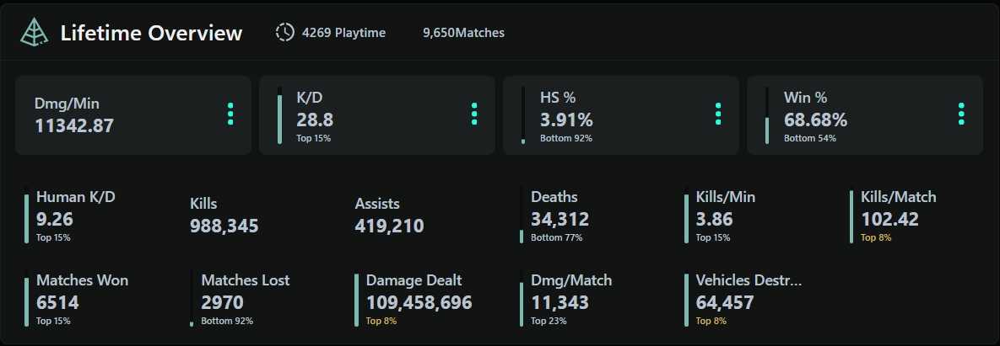
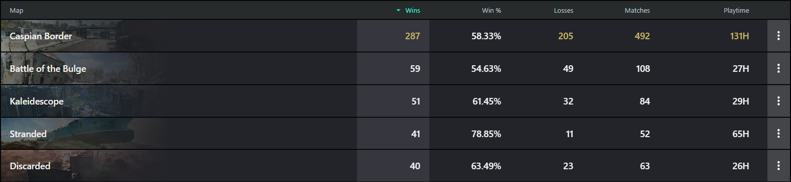
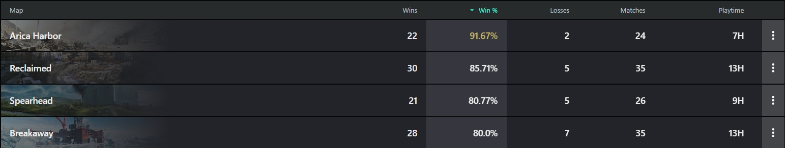
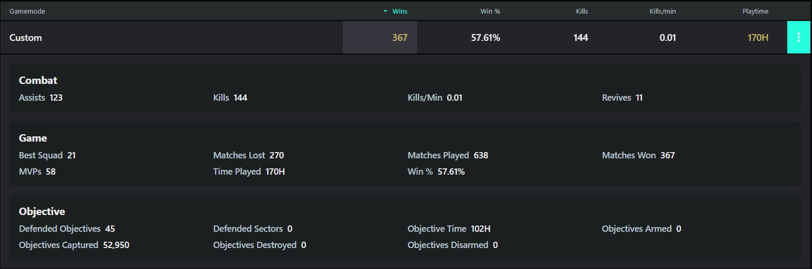

# Project Name
Game Data Hub

# Project Introduction
This project can assist gamers in gaining a better understanding of their gaming data, such as proficiency with specific weapons and vehicles, highest win rates on particular maps, and the frequency of achieving MVP status in different modes. These insights enable players to enhance their self-awareness, elevate the gaming experience, and visualize their rankings among queried players who have used this project.  
Currently, this project is implemented for the game Battlefield 2042. Therefore, the following examples will be based on this game.   
For instance, you can review your overview data:

The highlighted metallic data indicates that the player holds a prominent position in the ranking for this specific data category. Players also can review other six sections: Maps, Modes, Specialists, Weapons, Gadgets and Vehicles. In these sections, you can sort data based on different headers. For example, in the "maps" section, you can arrange data in ascending or descending order by "wins."  

Of course players also can choose win % to review a descending order:  

If players wish to access additional data, they can click the three circles located at the end of each item to explore more details. For instance, when players navigate to the "Modes" page and click the three circles, additional data will be displayed on the screen. Clicking the three circles again will hide the additional data.  

# System requirements
.Net Framwork 4.7.2  
EntityFramework 6.4.4, with code first approach
SQL Server, need support SQL Server Agent
Anime JS

# Installation
1. Clone or download the project code.
2. Open the solution file: [GAMEDATAHUB.sln].
3. Compile and run the project using Visual Studio.

# Frequently Asked Questions
Q: Why do some players' data in the Overview show as all top 0%?  
A: The API used in the project does not include the ranking of each data among all players. Therefore, when a player is searched for the first time, these ranking data display as 0. Subsequently, the database will automatically update the ranking data through SQL SERVER Agent.  

Q:Why can't I find the player's data in my query?  
A: First, make sure the player's name and platform are correct. Secondly, if the player chooses not to share game data in the game, the API query will not be able to retrieve data for that player. Finally, the project uses an API from https://api.gametools.network/docs, which is not the official API. Therefore, if there are issues with gametools' servers, it may not be possible to query the player's data.  

Q:When I query player data, why is it sometimes fast and sometimes slow?  
A:As the project has only completed development for one game and there is no plan to officially launch the project, it is deployed on a free Azure server with limited resources. This may affect the speed of the project due to the limited server resources.

# Collaboration
I plan to develop a mobile app using .NET MAUI. If you are familiar with .NET MAUI and interested in the project, please contact me.

# Contact
[Send me Email](mailto:Davdi.Feng1005@gmail.com)  

[Linkedin](https://www.linkedin.com/in/chenwei-feng)

# Notice
This project is intended solely for communication and learning purposes. It should not be used for any commercial activities, and any consequences arising from such use will be the responsibility of the user.
